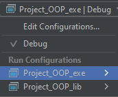
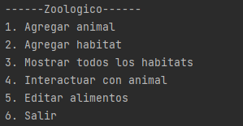
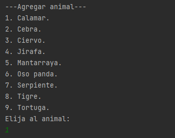
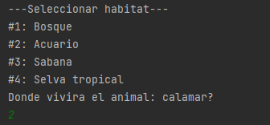
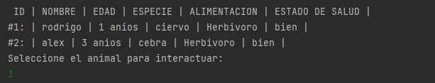
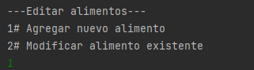
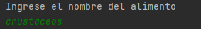
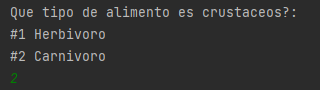

# Zoológico

#### Nota:
Esto es una prueba para comprobar que la nueva rama esté funcionando.

## Presentación general

Este proyecto simula un zoológico en el que se pueden realizar diferentes acciones e interacciones con los animales que habitan en él.

## Compilación y ejecución

El proyecto usa CMake para su compilación, tenga en cuenta que deberá tenerlo instalado para poder compilar el código.

Si no lo tiene instalado, puede instalarlo desde la página oficial de CMake: https://cmake.org/download/


### Compilación general

Abre una terminal en la raíz del proyecto y ejecuta el siguiente comando:

    cmake -S . -B ./build

Este comando le dice a CMake que utilice el archivo CMakeLists.txt en el directorio actual (-S .) y que genere el Makefile en el directorio build (-B ./build).

Una vez asignado el Makefile, puedes compilar el proyecto ejecutando el siguiente comando en la terminal:

    cmake --build ./build


### Desde CLION

Abrir CLion > Abrir Proyecto > Seleccionar este repositorio.

Una vez en el proyecto, para asegurarse que los CMake están asignados correctamente, debería recargar el proyecto de CMake.

Herramientas > CMake > Recargar Proyecto de CMake como se muestra en la imagen.


Una vez hecho esto, las configuraciones de ejecución ya estarían disponibles y se podría ejecutar el programa.



## Ejecución

### Selección de configuración básica

Para hacer pruebas, en el archivo main se puede encontrar la instancia del zoológico. Se puede seleccionar una configuración básica del zoológico basándonos en el parámetro que se le dé al constructor.

Se puede crear desde un zoológico vacío, hasta un zoológico con unos cuantos hábitats y algunos animales en ellos. Las configuraciones son las siguientes:

```
#1 Zoologico(0); //Zoológico vacío
#2 Zoologico(1); //Zoológico con 4 hábitats vacíos
#3 Zoologico(2); //Zoológico con 4 hábitats y algunos animales en un par de ellos.
#4 Zoologico(3); //Zoológico con 4 hábitats y 2 animales en todos ellos.
```

El siguiente código muestra cómo se crea un Zoológico con la tercera configuración desde el main:

```
int main() {
    Zoologico zoo = Zoologico(2); //iniciar zoo con 4 hábitats y algunos animales.

    zoo.menu(); //desplegar el menú principal
    return 0;
}
```

## Funcionalidades del zoológico

Las acciones que se pueden hacer en el zoológico aparecen en el menú principal:



A continuación se muestra como funciona cada una de las opciones anteriores:

## Agregar animal

Lo primero que se debe hacer es elegir qué animal se quiere agregar al zoológico:



Posteriormente, se le pedirá al usuario la información sobre este animal:


Finalmente, se le pregunta al usuario en que hábitat desea poner al animal:



Tenga en cuenta que no puede agregar cualquier animal a cualquier hábitat.

### Restricciones de los hábitats de los animales

Lógicamente, hay animales que no pueden habitar en ciertos hábitats. Por ejemplo, una jirafa no sobreviviría mucho en un acuario, ni una mantarraya sobreviviría mucho en un bosque.

El programa tiene un sistema que evita que este tipo de situaciones ocurran.

Cada animal tiene sus propias restricciones en la función puedeHabitar(), la cual recibe el hábitat que se quiere comprobar si es habitable por la especie o no.

A continuación, se muestra cómo está implementado en el tigre:

```
bool Tigre::puedeHabitar(Habitat * habitat) {
    //si el habitat recibido es bosque o sabana, sera verdadero.
    bool puedePertenecer =    habitat->getNombre() == NOMBRE_SABANA
                           || habitat->getNombre() == NOMBRE_BOSQUE
                           || habitat->getNombre() == NOMBRE_SELVA;
    return puedePertenecer;
}
```

Este animal puede habitar 3 biomas: la sabana, el bosque y la selva. La función retornará verdadero si el hábitat recibido es alguno de esos hábitats, y retornará falso cuando se pregunte si el tigre puede habitar el acuario.

A continuación, otro ejemplo con la mantarraya:
```
bool Mantarraya::puedeHabitar(Habitat* habitat) {
    //si el hábitat recibido es acuático, será verdadero.
    bool puedePertenecer = habitat->getNombre() == NOMBRE_ACUARIO;
    return puedePertenecer;
}
```
En este caso, la función solo retornará verdadero cuando el hábitat recibido sea el acuático, el único que puede habitar la mantarraya en el zoológico.


## Agregar hábitats nuevos

Hay 4 tipos de hábitats que el usuario puede agregar al zoológico, al momento de agregar uno nuevo se le pregunta al usuario qué tipo de hábitat desea agregar:


Después de escoger el tipo de hábitat, se le pedirá al usuario que escoja que características tendrá el hábitat, todos los tipos de hábitats tienen características diferentes para configurar.


Una vez ingresada la información, el nuevo hábitat será agregado al zoológico automáticamente.

## Mostrar todos los hábitat

Esta opción mostrará toda la información de todos los hábitat, sus características y los animales que contiene:


## Interactuar con los animales

Se puede interactuar con cada animal del zoológico y pedirle que ejecute una acción, cada animal puede ejecutar acciones diferentes acordes a su especie.


Primero se le preguntará al usuario en dónde está el animal con el que se quiere interactuar, en este caso está en el hábitat número 3 que es una sabana.



Luego se le pide al usuario que elija al animal con el que quiere interactuar, en este caso se eligió a alex, un pequeño ciervo de un año de edad.



Luego se le mostrará al usuario las acciones que le puede pedir a Alex que haga, el usuario deberá escribir que acción deberá hacer Alex, en este caso se le dijo a Alex que salte.

## Editar la alimentación de los animales

La alimentación de los animales puede ser editada por el usuario, cada animal se alimenta de diferentes tipos de comida.



Para editar la alimentación de un animal se le preguntará dónde está el animal al que se le quiere modificar la alimentación.



Se le preguntará al usuario como se llama la comida que se le dará al animal a partir de ahora.


El usuario deberá decir que tipo de comida es la que se le dará al animal.

Debe tenerse en cuenta que los animales carnívoro deben consumir solo comida para carnívoros, los animales herbívoros deben consumir solamente comida para herbívoros.
Mientras que los animales omnívoros pueden consumir los 2 tipos de alimento.

Si el usuario intenta alimentar a un animal carnívoro con un alimento herbívoro, el zoológico no lo permitirá.

## Diagrama UML

En el siguiente enlace se puede encontrar el diagrama UML usado para realizar este proyecto:

https://drive.google.com/file/d/1uwQcDSWyodwFfE5bc-91aWMbb_9pQrni/view?usp=sharing

## Informe de autoevaluación

En el siguiente enlace se encuentra mi informe de autoevaluación sobre el proyecto, además de mi opinión al respecto del mismo:

https://docs.google.com/document/d/1OCGSnm-X7Bsu_OYuvclc9SyKjSL2nzfhW7SLGxYHYKI/edit?usp=sharing