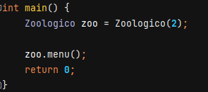

# Zoológico

## Selección de configuración básica.
Para hacer pruebas, en el archivo main se puede encontrar la instancia del zoológico, se puede seleccionar una configuración básica del zoológico en base a el parametro que se le de al constructor.

Se puede crear desde un zoológico vacío, hasta un zoológico con unos cuantos habitats y algunos animales en ellos, las configuraciones son las siguientes.

```
  #1 Zoologico(0); //Zoológico vacío
  #2 Zoologico(1); //Zoológico con 4 habitats vacíos
  #3 Zoologico(2); //Zoológico con 4 habitats y algunos animales en un par ellos.
  #4 Zoologico(3); //Zoológico con 4 habitats y 2 animales en todos ellos.
  ```

En la siguiente imagen se muestra como se crea un Zoológico con la tercera configuración.


